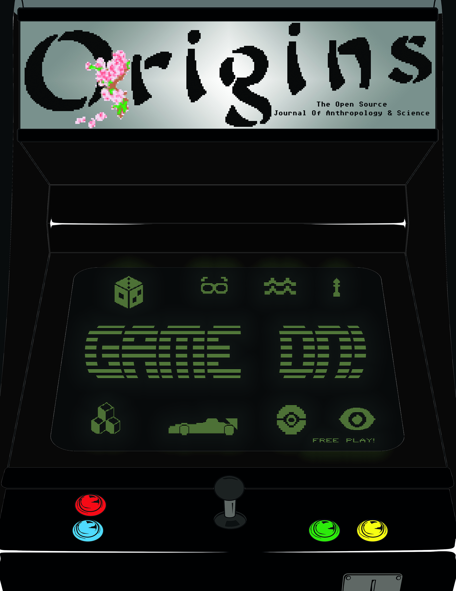

# Issue 12: Game On!

Why do we game? What do we consider games? What's up with all these batteries and software updates all the time to even get to the game?! We're diving into the material and digital culture of gaming, across time and around the world. It's GAME ON!

---

### On The Cover

Back when I first pitched (read: begged) Melanie about a video game themed special issue, I knew I wanted to have an old school arcade cabinet as the cover. Arcades were such a big part of gaming culture in the late 80s and early 90s. Kids lining up, putting their quarters on the arcade cabinet to queue up for the next turn to play, the sounds, the music, the graphics. Nostalgia is good stuff and I tried to capture that. Also inside scoop: each little icon used in the cover represents one of the articles inside. We also incorporated the idea of Free Play with arcade machines and our philosophy of bringing Origins to people for free, keeping it open access and open source, and inviting everyone to come and play with us. - Ethan Kellogg