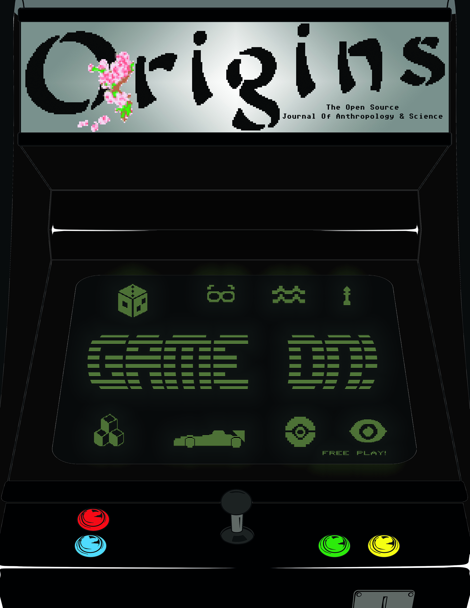

# Theme: Game On!

Why do we game? What do we consider games? What's up with all these batteries and software updates all the time to even get to the game?! We're diving into the material and digital culture of gaming, across time and around the world. It's GAME ON!

---

**© [Origins Scientific Research Society](http://www.knowyourorigins.org)**

This work is licensed under a [Creative Commons Attribution-ShareAlike 4.0 Unported License]((https://creativecommons.org/licenses/by/4.0/). Permission of the authors is required for derivative works, compilations, and translations. All images use the Creative Commons license listed with the asset which may not be equal to that of this compilation.

***Disclaimer:*** The views expressed in this publication are those of the authors and do not necessarily reflect the position or views of Origins. The publisher, editor, contributors, and related parties assume no responsibility for loss, injury or inconvenience of any person, organization, or party that uses the information or resources provided within this publication, website, or related products.

Errors, Bugs, Have Changes? [Submit them on GitHub](https://github.com/OriginsSRS/theme-game-on/issues)!

Want to verify an article as an Open Peer Reviewer? [Get in Touch](mailto:editor@knowyourorigins.org)!

---

### Our Contributors

**Editor-in-Chief & Creative Director:** Melanie E Magdalena

**Copy Editors:** Priscilla Aguilera, Margaret Smith

**Graphic Design:** Ethan Kellogg

**Marketing & Public Relations:** Alex Vosburgh

**Contributing Authors:** Colton Caldwell, Connor Lemp, Liz Lypp, Karen Meza, Jenn Swanson

---

