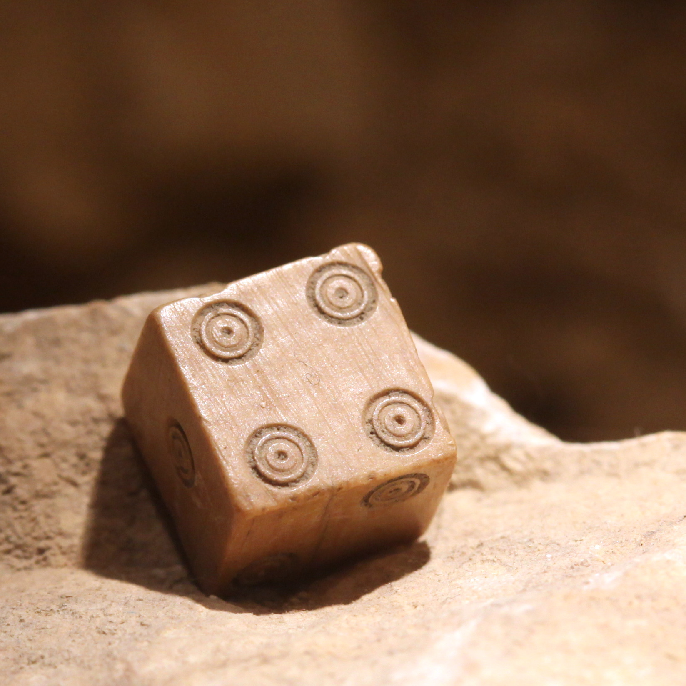

# A (Marginally Adequate) History of Dice

---

Image Credit: Rama | CC BY -SA 2.0 FR

---

If you look up dice in the Merriam-Webster dictionary, you will find them defined as "a small
cube that is made of plastic, wood, etc., that has one to six dots on each side, and that is used usually in pairs in various games." This definition covers the broadest uses of dice today, but it does a terrible disservice to the diversity of dice and games of chance. A broader, and more historically accurate, definition would be something like this "small polyhedral objects inscribed with numbers or symbols, designed to be thrown to produce random results." I might mention games in my definition, if it weren't for the completely serious tradition of Cleromancy, in which the future is divined by the drawing of lots and the casting of dice.

Dice have been made in many shapes and sizes, and inscribed with many different sets of symbols. In modern dice numbers are common, as are small dots called pips. Ancient dice were often inscribed with symbols or letters, and some modern dice mimic this design. Throughout history dice have been produced from every imaginable substance. Early examples were made of stone, wood, or bone from various animals. The most ancient dice that have been found are made of stone, likely due to its durability compared to alternative materials. Modern dice are most often made of plastics, formed through injection molding. Some of the oldest dice were carved from the Astragalus bones of animals. The common nickname “knucklebones” is quite literal. Later, knucklebone dice imitated Astragalus bones in shape and size, but were made of stone or other materials. The game of knucklebones, described by Sophocles in 1188 BCE, is the historical predecessor to the modern game of jacks and was played in a very similar way.

The earliest known dice were found in an excavation in modern day Turkey. The find was dated to the year 3000 BCE. These dice were 4-sided, and found with a trove of other gaming pieces. In 2600 BCE, ancient Sumerians used 4-sided dice in a game now called the Royal Game of Ur. Replicas of the Royal Game of Ur are available, and a Babylonian tablet dating from 176 BCE allowed for translation of at least some of the rules. Derivations and reconstructions of the game vary in their interpretation of rules, but are still a blast, even after five thousand years. The pharaohs certainly thought so. A board for the Royal Game of Ur, known as Asseb in Egypt, was found in Tutankhamen’s tomb. Egypt has had an on-going love affair with dice throughout recorded history. The oldest known 20-sided die was found in Egypt. It is made from serpentine, and inscribed with Greek symbols for an unknown purpose. Egypt is also responsible for the oldest known 6-sided die, from 2000 BCE, and the oldest 12-sided die, from 150 BCE.

[ Watch "The History of Dice in Under 6 Minutes" by Board With Life](https://www.youtube.com/watch?v=NtvBpKirE3s)

Not to be outdone, the Roman empire is responsible for the oldest 6-sided die with what we would consider standard pip markings. The piece, found near Rome, dates from 900 BCE. The Romans also claim the second oldest 20-sided die, from 100 CE. It is made of a dull, green-tinted glass, and inscribed with Roman symbols. Very few cultures have not appropriated or invented dice of some kind. Holes punched in the floors of the Tlacuachero site in Mexico appear to be scoreboards for dice games. 6-sided dice have been found in excavations in China going back to the year 600 BCE, and 6-sided dice have been found in Viking graves from 1000 CE. No doubt the dice were used for entertainment on their long voyages.