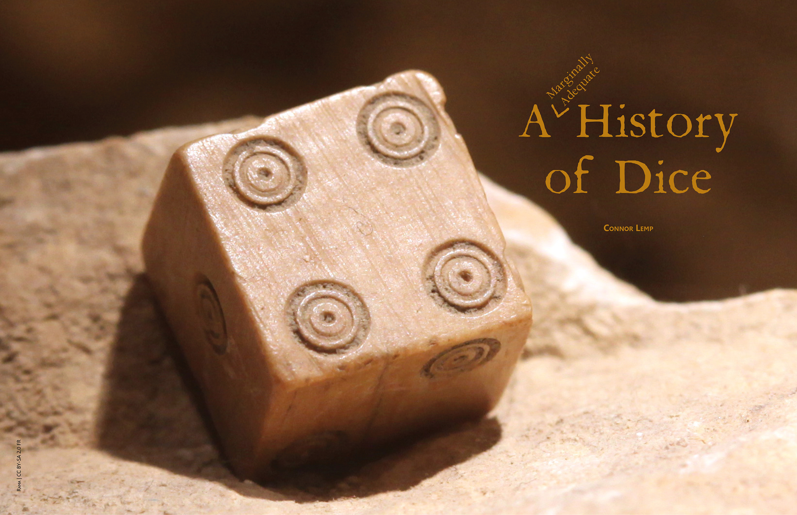
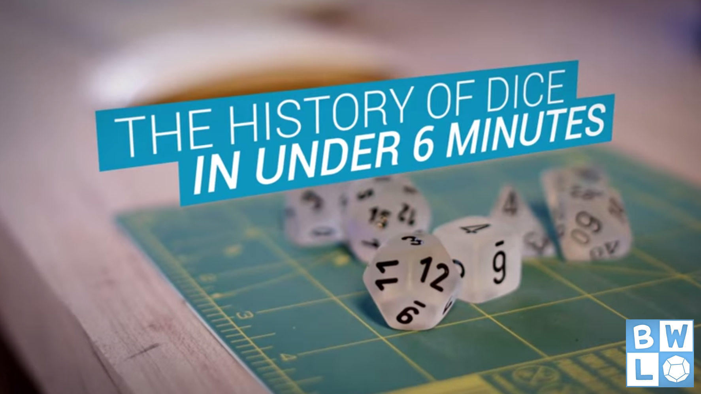
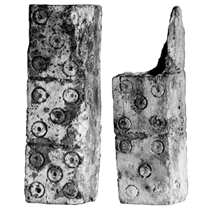
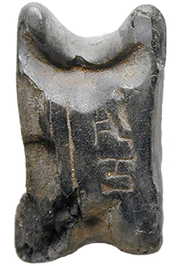
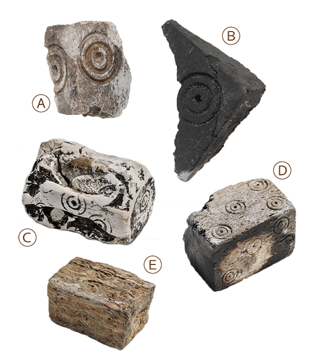
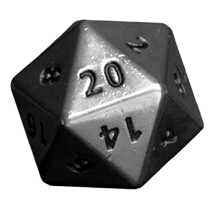
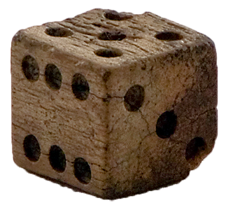

# A (Marginally Adequate) History of Dice

---

*A Roman die on display at Vidy Roman Museum.* 
Image Credit: [Rama](https://commons.wikimedia.org/wiki/File:Roman_dice_IMG_4367.JPG) | [CC BY-SA 2.0 FR](https://creativecommons.org/licenses/by-sa/2.0/fr/deed.en)

---

If you look up dice in the Merriam-Webster dictionary, you will find them defined as "a small cube that is made of plastic, wood, etc., that has one to six dots on each side, and that is used usually in pairs in various games." This definition covers the broadest uses of dice today, but it does a terrible disservice to the diversity of dice and games of chance. A broader, and more historically accurate, definition would be something like this "small polyhedral objects inscribed with numbers or symbols, designed to be thrown to produce random results." I might mention games in my definition, if it weren't for the completely serious tradition of Cleromancy, in which the future is divined by the drawing of lots and the casting of dice.

Dice have been made in many shapes and sizes, and inscribed with many different sets of symbols. In modern dice numbers are common, as are small dots called pips. Ancient dice were often inscribed with symbols or letters, and some modern dice mimic this design. Throughout history dice have been produced from every imaginable substance. Early examples were made of stone, wood, or bone from various animals. The most ancient dice discovered are made of stone, likely due to its durability compared to alternative materials. Modern dice are most often made of plastics, formed through injection molding. Some of the oldest dice were carved from the Astragalus bones of animals. The common nickname "knucklebones" is quite literal. Later, knucklebone dice imitated Astragalus bones in shape and size, but were made of stone or other materials. The game of knucklebones, described by Sophocles in 1188 BCE, is the historical predecessor to the modern game of jacks and was played in a very similar way.

The earliest known dice were found in an excavation of what is now modern day Turkey. The find dates to the year 3000 BCE. These dice are 4-sided and discovered with a trove of other gaming pieces. In 2600 BCE, ancient Sumerians used 4-sided dice in a game now called the Royal Game of Ur. Replicas of the Royal Game of Ur are available, and a [Babylonian tablet](http://www.britishmuseum.org/research/collection_online/collection_object_details/collection_image_gallery.aspx?assetId=129985&objectId=796973&partId=1#more-views) dating from 176 BCE allowed for translating some of the rules. Derivations and reconstructions of the game vary in their interpretation of rules, but are still a blast, even after five thousand years. The pharaohs certainly thought so. A board for the Royal Game of Ur, known as Asseb in Egypt, was found in Tutankhamen's tomb. Egypt has had an [on-going love affair](http://io9.gizmodo.com/5958203/is-this-the-oldest-d20-on-earth) with dice throughout recorded history. [The oldest known 20-sided die](http://www.metmuseum.org/art/collection/search/551072?img=0) is Egyptian, crafted from serpentine, and inscribed with Greek symbols for an unknown purpose. Egypt is also responsible for the oldest known 6-sided die, from 2000 BCE, and the oldest 12-sided die, from 150 BCE.

---

[ Watch "The History of Dice in Under 6 Minutes" by Board With Life](https://www.youtube.com/watch?v=NtvBpKirE3s)

---

Not to be outdone, the Roman empire is responsible for the oldest 6-sided die with what we would consider standard pip markings. The piece, found near Rome, dates from 900 BCE. The Romans also claim the second oldest 20-sided die, from 100 CE. It is made of a dull, green-tinted glass, and inscribed with Roman symbols. Very few cultures have not appropriated or invented dice of some kind. Holes punched in the floors of the Tlacuachero site in Mexico appear to be scoreboards for dice games. 6-sided dice have been found in excavations in China going back to the year 600 BCE, and 6-sided dice have been found in Viking graves from 1000 CE. No doubt the dice were used for entertainment on their long voyages.

There are many styles of dice. The most common today are made in the shapes of platonic solids. These dice have 4, 6, 8, 12, and 20 sides. The exception to the rule is the much more modern 10-sided die, which is not a platonic solid. 10-sided dice are used in pairs to create percentages, and are sometimes called percentage dice for this reason. Other types of dice exist, such as barrel dice. These dice are aptly named, made with numbers printed along flat sides on the outside edge of the 'barrel'. These dice are not thrown, but instead rolled in the direction of their long edge. The bulk of historical dice are made in the shape of platonic solids or are made to mimic an existing shape in nature, such as knucklebones dice.

Dice have found many uses in human history. Dice have been used in divination, as part of board games, in word games, and in modern efforts to teach math and probability. A common use for modern dice is in roleplaying games. Popularized by Dungeons and Dragons starting in 1974, this style of game is permanently associated with 10, 12, and 20-sided dice in popular culture. And of course, there's the elephant in the room. Gambling. Gambling is one of the oldest and most popular pastimes of mankind. The first written reference to gambling was made in the Sanskrit epic Mahabharata in the year 400 BCE. Dicing was a frequent pastime in Rome, despite the fact that law forbade it except during the Saturnalia. Gambling with dice was said to be popular among Germanic peoples in the time of Tacitus, and to knights during the middle ages. In France, gambling with dice was immensely popular among knights and ladies, despite many laws banning it. Even multiple interventions by Louis IX, the reigning monarch, failed to curb the popularity of dice games in France.

---

## Dice from Around the World

| Specimen | About |
| -- | -- |
|  | **What ::** Bone marked off for dice  **Who & When ::** Roman, 1st-3rd Century **About ::** Only 3 sides of each piece is finished. After separation, bone hollows would be filled with other bits of bone and numbers carved on all 6 sides. **Courtesy of ::** Walters Art Museum [[Left](http://art.thewalters.org/detail/19332/numbers-3/)/[Right](http://art.thewalters.org/detail/19332/numbers-2/)], [CC BY-SA 3.0](https://creativecommons.org/licenses/by-sa/3.0/) |
|  | **What ::** Inscribed Os (Knucklebone) **Who & When ::** Egyptian, 2687 - 333 BCE **About ::** Astragalus bone, carved. In pop culture, "roll them bones" refers to knucklebone dice. **Courtesy of ::** [LACMA](https://commons.wikimedia.org/wiki/File:Inscribed_Os_(Knucklebone)_LACMA_M.80.202.296.jpg), Public Domain |
|  | **What ::** Various Dice **Who & Where ::** Vikings, Sweden **About ::** Likely used for playing games. [A & B](https://www.flickr.com/photos/historiska/6777026822/in/gallery-osrs-72157651342461995/) - Bone/antler grave find, from Björkö, Adelsö, Uppland [C](https://www.flickr.com/photos/historiska/13621939844/in/gallery-osrs-72157651342461995/) - Bone/antler find from unknown location [D](https://www.flickr.com/photos/historiska/13621608375/in/gallery-osrs-72157651342461995/) - Bone/antler grave find, from Sörby, Hölö, Södermanland [E](https://www.flickr.com/photos/historiska/13622368263/in/gallery-osrs-72157651342461995/) - Teeth (from elk) grave find from Björkö, Adelsö, Uppland **Courtesy of ::** The Swedish History Museum, Stockholm, [CC BY-NC-SA 2.0](https://creativecommons.org/licenses/by-nc-sa/2.0/) |
|  | **What ::** Brushed Steel Icosahedron **When ::** 21st century **About ::** From Ethan's personal collection used to smite dragons, save damsels, and purchase cheap ale at the inn. **Courtesy of ::** [Ethan Kellogg](https://www.fatsackgaming.com), [CC BY 4.0](https://creativecommons.org/licenses/by/4.0/) |
|  | **What ::** Bone die **Who & When ::** United States, 1823-1834 **About ::** Discovered at Cantonment Clinch, an American fort used in the Civil War by both Confederate and Union troops at separate times. **Courtesy of ::** [Kolby Kirk](https://commons.wikimedia.org/wiki/File:Die_bone.jpg), [CC BY 3.0](https://creativecommons.org/licenses/by/3.0/) |

---

Gaming with dice can take many forms and use many different rules. Because the rules for historical dice games were not always recorded, we often have no idea how ancient dice were used. Some games rely on dice to randomize actions, such as determining the outcomes of actions in roleplaying games, or to determine how far to move a piece in a board game. Other games use dice as a random element to guess against, such as in craps, where bets are made against the value displayed on the dice. Craps is one of the most widely known games to rely on dice. Due to their popularity, and the high stakes sometimes placed on them, the dice used in craps are subjected to great scrutiny. Modern casino dice are made in a specific way to make tampering obvious, and to ensure that dice rolls are fair.

To understand fair dice, you have to understand unfair dice as well. There is a long history of people cheating at dice games. The history of loaded dice is likely almost as long as dice themselves. Fair dice can be expected to land on one side just as often as another. All sides of a fair die are of equal weight and size, with sharp, unrounded edges. Unfair dice can be created accidentally or intentionally in a number of ways. With the reliability of modern injection molded dice, it can be safely said that any dramatically unfair dice you come across have been made that way deliberately.

There are a few basic ways of creating unfair dice. Perhaps the most obvious is weighting. When weighting a modern die, the prospective cheater will drill out holes in the pips of gambling dice, insert small weights, and seal the hole back up again. There are a number of ways to prevent this from happening, and casinos use the most obvious: Casino dice are made of a translucent plastic, so that any such tampering would be plainly visible. A variant of this method can be used on dice whose pips are recessed into the surface. The pips would be carefully filled with a tiny amount of a very heavy substance, like lead, then painted over. While it may seem like a tiny change, a clever gambler could leverage a small change in the probability of dice to their advantage. Again, preventing this sort of cheating is simple. Casinos use dice with flat surfaces, opting to paint the pips onto the surface of dice. In fact, casinos use a paint with the same specific gravity as the plastic itself, so that not even the weight difference of the paint markings affects the roll.

---

#####Did you know the average roll on a twenty sided die is 10.5? Do you know what the average roll is when you roll three six sided die together and add the results together? Also 10.5. Maths.

---
Unfair dice can also be made by removing surface material from the dice. There are two main ways this is done, either shaving or beveling. To shave a die, one removes a smooth layer of material from two opposing faces of the die. By doing this, the shaved faces remain at their original width, but the remaining 4 faces of the die will have slightly less surface area as rectangles. The die is then more likely to land on one of the shaved faces since they retain their square shape. To bevel a die, a cheater will remove some material from the face of a die to make it slightly convex. Because it is slightly more rounded than other sides of the die, it is more likely to roll off of that side, and come to rest on a flat one. Dice modified in this way can detected by creating a 'box' of fair dice, and fitting the suspected crooked die within the space created. Fair dice will slide into the open space smoothly, and with no spare room. Dice that have been shaved or beveled will reveal small gaps in the pattern.

Another way to create unfair dice is to cook them. While it sounds like a nickname, this one is literal. A careful cheater can gradually heat plastic dice in an oven with the most desired surface facing up. If carefully heated, the dice will imperceptibly deform, leaving the bottom of the cooked die slightly wider and heavier than the top. If used cautiously, this method can yield a die that appears to be perfectly normal, bu rolls the desired number with much greater frequency. These dice can be detected by throwing them in a glass of water. If the plastic is heavier than the water, then the bottom of the cooked die will always rotate to the bottom of the glass. If the plastic is lighter than water, the bottom of the cooked die will always rotate to face upwards from the glass. The water test can also be applied to opaque dice that are suspected to be weighted. When thrown in water, weighted dice will always rotate the heaviest face downward as they sink. There are many other, more complex ways of creating crooked dice. Some methods of cheating at dice will defeat even these methods of detection.

People put a lot of effort into dice, both at creating them and cheating at them. Throughout human history, incalculable sums of money and goods have exchanged hands as a result of the fall of dice. Dice have made and lost fortunes in instants, and the randomness of even fair dice often goes against the participant of a game. You might expect that their capricious nature would dull some of our love for dice, but you would be wrong.

---

###About the Author

**Connor Lemp** is an writer and editor, both professionally and for his roleplaying games.

---

###References

* Becker, A. (2008). **[The Royal Game of Ur.](http://www.merriamwebster.com/dictionary/dice)** In Finkel (ed.). pp. 11-15.

* **[Dice [Def. 1]](http://www.merriam-webster.com/dictionary/dice)**. Merriam-Webster Online.

* Evans, C. (n.d.). **[The History of Dice.](http://www.theevansgroupllc.com/published-articles/the-history-of-dice/)** The Evans Group, LLC.

* Graham, J. and Graham, K. (n.d.). **[Crooked Dice.](http://www.thebrothersgraham.com/loading.html)** The Brothers Graham.

* Halliday, W.R. (1913). **[Greek Divination: A Study of its Methods and Principles.](http://www.ancientlibrary.com/divination/0217.html)** MacMillan and Co., Limited.

* History of Dice. (2012). **[Awesome Dice.](http://www.awesomedice.com/blog/253/history-of-dice-2/)**

* **[How To Load Dice.](http://www.wikihow.com/Load-Dice)** (n.d.). WikiHow.

* Rowland, I. (2009). **[How Do You Load a Pair of Dice.](http://www.straightdope.com/columns/read/2878/how-do-youload-a-pair-of-dice)** The Straight Dope.