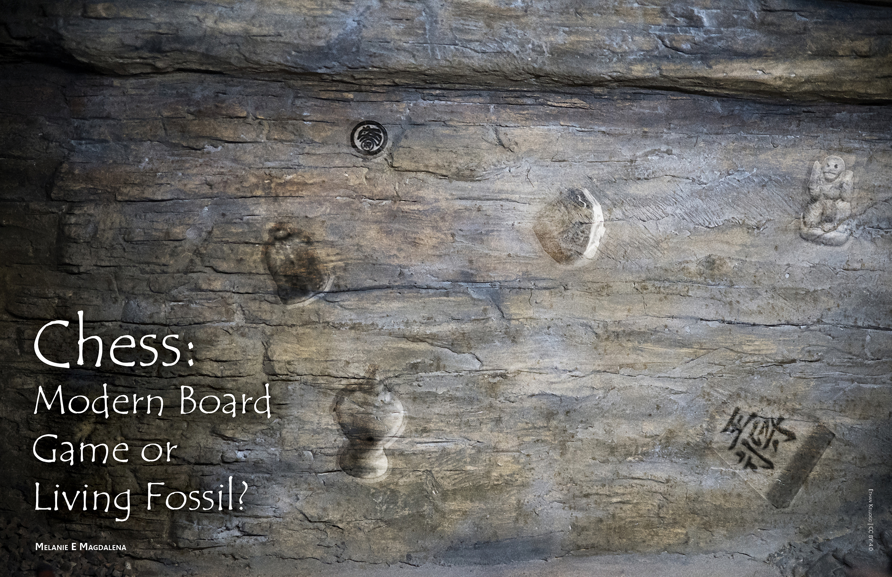

# Chess: Modern Board Game or Living Fossil?

---

Image Credit: Ethan Kellogg | [CC BY 4.0](https://creativecommons.org/licenses/by/4.0/)

---

**[Melanie E Magdalena](www.knowyourorigins.org/team/magdalena.html)** is a passionate bilingual creator and developer searching to bridge gaps in society with technology and information by using her rich scientific and digital media background, complemented by studies in anthropology, earth science, and design strategy, with work experience in higher education.

---

###References

Banaschack, P. (1999). **Chess Historians and their definitions of chess.** Banaschak.net. http://www.banaschak.net/schach/chessdefinitions.htm

Banaschack, P. (2001). **Chess in East Asia: Xiangqi, Changgi, Shogi: Sources on their history and development until 1640 [thesis].** Banaschak.net. http://www.banaschak.net/schach/dissabstren.htm

Banaschak, P. (1999). **Early East Asian Chess Pieces: An overview.** Banaschak.net. http://www.banaschak.net/schach/EastAsianChessPieces2.htm

Banaschack, P. (1997). **Facts on the origins of Chinese Chess (Xiangqi 象棋).** 4th Symposium of the Initiative Gruppe Königstein, Wiesbaden, August 1997. http://www.banaschak.net/schach/origins.htm

Bhatta, C.P. (1995). **Antiquity of Indian Board Games - A New Approach.** New Approaches to Board Games Research, Asian Origin and Future Perspective, IIAS Working Papers Series 3, Leiden. http://history.chess.free.fr/papers/Bhatta%201995.pdf

Bock-Raming, A. (1995). **The Varieties of Indian Chess Through The Ages.** Asiatische Studien - Etudes Asiatiques, XLIX 2. http://history.chess.free.fr/papers/Bock-Raming%201995.pdf

Bock-Raming, A. (1995). **The Literary Sources of Indian Chess And Related Board Games.** New Approaches to Board Games Research, Asian Origin and Future Perspective, IIAS Working Papers Series 3, Leiden. http://history.chess.free.fr/papers/Bock-Raming%201995-NABGR.pdf

Buryakov, Y. (2000). **Chess in ancient Afrasaib.** Journal of the Academy of Arts of Uzbekistan, San’at 4. http://history.chess.free.fr/papers/Buryakov%202000.pdf

Calvo, R. (2001). **The Oldest Chess Pieces in Europe.** IGK Conference, Amsterdam. http://history.chess.free.fr/papers/Calvo%202001.pdf

Calvo, R. (1998). **Valencia Spain: The Cradle of European Chess.** CCI Conference, Vienna, Austria, May 1998. http://history.chess.free.fr/papers/Calvo%201998.pdf

Caso, A. (1925). **Un antiguo juego mexicano: el Patoll.** El Mexico Antiguo: 203-11. http://history.chess.free.fr/papers/Caso%201925.pdf

Cazaux, J.L. (2012). **A critical review of “The Beginnings of Chess.”** 
http://history.chess.free.fr/mark2007.htm

Cazaux, J.L. (2001). **Is Chess a Hybrid Game?** IGK Symposium, Amsterdam. Also in The Anatomy of Chess, Tübinger Beiträge zum Thema Schach Band 8, Pfullingen, Promos-Verlag. http://history.chess.free.fr/papers/Cazaux%202001.pdf

Cazaux, J.L. (2010). **The Afrasiab Chessmen.** http://history.chess.free.fr/afrasiab.htm

Cazaux, J.L. (2012). **Shatranj, the medieval Arabian Chess.**  http://history.chess.free.fr/shatranj.htm

Cazaux, J.L. (2014). **Shogi, the Japanese Chess.**  http://history.chess.free.fr/shogi.htm

Cazaux, J.L. (2014). **Les différents échecs de l’ancien monde.** http://history.chess.free.fr/variety.htm

Ferlito, G. and A. Sanvito. (1990). **Origins of Chess, Protochess, 400 B.C. to 400 A.D.** The Pergamon Chess Monthly 55(6). http://history.chess.free.fr/papers/Ferlito-Sanvito%201990.pdf

G., M. (2002). **The Arab Role in the Development of Chess.** Al Shindagah.
http://www.alshindagah.com/marapr2002/chess.html

Horne, C.F. (ed.) (n.d.). **Kārnāmag-ī Ardaxšīr-ī Pābagān or Book of the Deeds of Ardeshir.** CAIS: The Circle of Ancient Iranian Studies. 
http://www.cais-soas.com/CAIS/Languages/pahlavi/karnamak.htm

Josten, G. (2001). **Chess - A Living Fossil [Thesis].** http://history.chess.free.fr/papers/Josten%202001.pdf

Kraaijeveld, A.R. (2000). **Origin of Chess A Phylogenetic Perspective.** Board Games Studies 3: 39-49. http://ex.ludicum.org/publicacoes/bgsj/3.pdf

Leventhal, D.A. (1978). **The Chess of China.** Mei Ya Publications. pp. 165.

Mark, M. (2007). **The Beginning of Chess. Ancient Board Games in perspective** (I.L.Finkel, ed.). London: British Museum Press. http://history.chess.free.fr/papers/Mark%202007.pdf

Masukawa, K. (1994). **The Origin of Japanese Chess.** Variant Chess Magazine 2(15): 100-4. http://history.chess.free.fr/papers/Masukawa%201994.pdf

Murray, H.J.R. (1913). **A History of Chess.** London, UK: Oxford University Press.

Piccione, P. (1980). **In Search of the Meaning of Senet.** Archaeology 33: 55-8. http://history.chess.free.fr/papers/Piccione%201980.pdf

Rajendran, A. (2005). **Exploring the Possibilities of Finding out the Nature of Chess in its Original Form.** Okkasioneller Rundbrief 29: 249-254. http://history.chess.free.fr/papers/Rajendran%20a.pdf

Remus, H. (2003). **The Origin of Chess and the Silk Road.** The Silk Road Foundation Newsletter. http://silkroadfoundation.org/newsletter/volumenumberone/origin.html

Samsin, M. (2002). **Pawns And Pieces: Towards The Prehistory Of Chess.** Also in The Anatomy of Chess, Tübinger Beiträge zum Thema Schach Band 8, Pfullingen, Promos-Verlag, 2003. http://history.chess.free.fr/papers/Samsin%202002.pdf

Suren-Pahlav, S. (ed.) (1998). **Chess: Iranian or Indian Invention?** CAIS: The Circle of Ancient Iranian Studies. http://www.cais-soas.com/CAIS/Sport/chess.htm

Thomsen, T. (2002). **Chess in Europe in the 5th century?** Board Games Studies 5: 103-4. http://history.chess.free.fr/papers/Thomsen%202002.pdf

Villa, M. (2004). **The Time of Shatranj and the Aliyat.** SchemingMind.com. http://www.schemingmind.com/journalarticle.aspx?article_id=3&page=1

Weeks, M. (n.d.). **Chess History.** Chess for All Ages. http://www.mark-weeks.com/aboutcom/caa-hist.htm