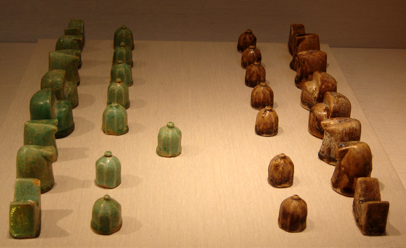

# Chess: Modern Board Game or Living Fossil?

---

Image Credit: Ethan Kellogg | [CC BY 4.0](https://creativecommons.org/licenses/by/4.0/)

---

It is a game, science, and sport. Seen as a war-game or mental martial art, the act of teaching and playing chess is often employed as a way to enhance mental prowess. Its origin remains unknown with no fixed point in time marking a first instance. The oldest archaeological evidence of a chess-like game was discovered by archaeologist and historian Jurij F. Burjakov. Named after their place of origin, the ivory Afrasiab Chessmen seven-piece set (c. 700-712 CE) was discovered in 1977 near Samarkand, Uzbekistan. Due to the multitude of variations throughout history, chess is likely the product of many people creating various games which were combined into the form of chess we recognize today.

When the Arabs arrived in Persia (638-651 CE), they assimilated Persian culture, including their game *chatrang*, a chess-like game. With the phonetic evolution from Persian to Arabic, *chatrang* became *shatranj* and prospered during the Arabic splendor of arts and sciences. Knowledge from ancient Byzantium, Egypt, Greece, Iran, and the Middle East was translated into Arabic. Chess was a part of the packaged knowledge with early mathematics, astronomy, philosophy and medical achievements, a scientific body of knowledge later sent to the West.

---

####*"Just as chess is a difficult game, its origin is a difficult puzzle." - Mark Weeks*

---

Prior to 600 CE, chess does not appear to exist in any recognizable form. While many scholars have proposed many locations for the geographic origin of chess (including China, post-Alexander Kingdom of Bactria, and the Kushan empire), the strongest argument proposes that chess emerged from Northwest India or Iran in the 7th century.

Irani literature contains the oldest records of chess-like games. The epical treatise *Karnamak-ī Ardeshīr-ī Pāpakān* (The Book of Deeds of Ardeshir-e Pāpakān) written during the Sasanian dynastic era (224-651 CE) mentions *chatrang* as one of young prince Ardeshir's great accomplishments. The *Mâdayân î chatrang* (c. 620 CE) and Iranian epic-poet Firdausi's *Shahnama* (c. 1010) recount the story of a game with thirty-two pieces⸺sixteen of emerald and sixteen of ruby⸺gifted to Sassanid king Khosrau I as a challenge and successfully mastered by his courtiers. Firdausi's claim is not only continuous from centuries prior, but he also mentions the game arriving from "Hind." Though "Hind" did refer to India after the 11th century, during the time of writing "Hind" referred to the Eastern province of the Iranian Empire.

*Shatranj*'s popularity encouraged tournaments. Many great players surged, some becoming *aliyat* (masters). One of the top *aliyat* of his time, Al-Adli (800-870 CE) wrote a book, *Kitab ash-shatranj* (Book of Chess) containing the proposed history and roots of the game from Indian *chaturanga*, along with chess problems, solutions, and a classification system for players based off of their strength and skill. Other *aliyat* also wrote important works (such as *Latif fi'sh-shatranj* by al-Adli's rival ar-Razi) which have helped researchers understand the popularity and persistence of *shatranj*.

*Chaturanga* is a chess-like game played on an 8x8 square board (rather than today’s 12x12 board). *Chaturanga* is Sanskirt (catuḥ: “four”; anga: “arm”) meaning "quadripartite" or "army." The name reflects the four components in Vedic army platoons. (A later experimental version, *chaturaji*, was a four-sided dice-based game.) Etymologically, the Sasanian-Pahlavi word "chatrang" supports an Indian origin theory; however, the terminology used for the pieces are identified as Persian. The Iranian mythical bird *Sên-Murv* was introduced as *rukh* in Arabic (the modern day "rook"). Depicted as a winged bird-shaped creature, the *rukh*’s role on the board is iconographically significant in the Iranian world: the bird created a union between the land and sky. In India, this piece is called *haathi* (elephant).

During the 9th century, Persian poet, musician, and singer Ali ibn-Nafi introduced *shatranj* to Spain. In the 13th century, the manuscript *Libro de los juegos* described the arrival of chess, backgammon, and dice. In Spain, the modern-day bishop was introduced as *alfil*, an Arabic loanword from Persian *pīl*. The *alfil* is shaped like an elephant. Many have argued that the presence of elephants points the game to an Indian origin, but elephants are not exclusive to India. Egyptian Ptolemaic Kings regularly acquired elephants from Somalia and Iranian armies included elephants along with foot-soldiers, chariots, riverships, cavalry, and battleships.

---

*Shatranj set from the 12th century, currently located at the New York Metropolitan Museum of Art.* Image Credit: [Zereshk](https://commons.wikimedia.org/wiki/File:Shatranj.jpg) | [CC BY 3.0](https://creativecommons.org/licenses/by/3.0/)

---

*Shatranj* arrived in Europe by at least four paths: Spain and Italy by conquest, through the Byzantine Empire in the Balkans, and in Russia and Scandinavia via the Volga River trade route from the Caspian Sea. The first European text about chess is a poem, *Versus de Scachis* (990 CE), describing the two-colored chess board and the first appearance of the Queen (rather than vizier). In the Latin epic *Ruodlieb* (c. 1050), a German monk from Tegernsee describes a medieval knight's adventures, which includes a case when the knight faced a high-stakes chess game against a king during negotiations. 

By the 12th century, chess had become a pastime for nobility, growing in popularity in France and Germany. French chess players were the strongest in the world from the mid-18th century to the mid-19th century, when chess clubs sprouted throughout London, shifting the epicenter of chess to England. Chess quickly became an organized sport, and other countries grew interested in participating. In 1851, Adolf Anderssen of Germany won the first international chess tournament held in London. Alexander Petrov of Russia wrote the first Russian manual *The Game of Chess* (1824). A century later, the Fédération Internationale des Échecs (FIDE) was founded at Paris. This variant of chess continues to this day.

Long before chess reached the FIDE international standard, the game was widespread across Eurasia. Chinese Buddhist monk Fazang (645-712) mentions a 2-player, military game in Central Asia in the text *Fanwang fazang shu*. In the game, each player has 20 small jade tokens, serving as elephants and horses, which must take strategic command of all the roads on the board. The text calls this game *prasena* and it may be a reference *chatrang* or the earliest testimony of *xiangqi*. 

Chinese *xiangji* or "elephant chess" makes its first undeniable appearance in *Xuanguai lu* written by Niu Sengru (779-847 CE), the Minister of State during the Tang Dynasty. The text tells the story of impoverished scholar Cen Shun who dreams of a battle. During this battle, horses (ma) move aslant over three spaces, the commander goes sideways and can attack on all four sides, the chariots (*chuh*) move straight forward but never backwards, and six armored men (*ping* or *tsuh*) go in file. The description references many of the modern *xiangqi* pieces but omits the elephant (*xiang*); the author may have felt the piece was implied or this piece may not have been in use. Bo Juyi (772-846 CE), friend of Niu Sengru, explicitly names soldiers and chariots in his poem *He chun shen ershi shou*. These two texts place *xiangji* in existence as a chess-like game in the 9th century.

Multiple sets of *xiangqi* have been recovered, with the first known set dating back to the Northern Song Dynasty (1102-1106). The set consists of a wooden box with a complete set of 32 copper disc-shaped pieces: two generals, four ministers, four elephants, four horses, four chariots, four cannons, and ten soldiers. Each piece was painted on one side with an image and the opposite with a character in either red or black ink. These pieces are cast and finished, presumably to remove grates from the metal. Poems by Emperor Huizong (*Xuanhe yuzhi gongci*) and Cai Shen (*Linjiangxian*) also mention ivory *xiangqi* pieces (c. 1082-1156). Archaeologists have also recovered painted black and white porcelain pieces from the Song Dynasty and wooden pieces from a sunken boat dating to the Northern Song Dynasty. The imperial treasury inventory of 1565 (Ming Dynasty) also states jade and ivory *xiangqi* pieces were kept. While the original materials varied and the dates for the game's widespread use are unclear, *xiangqi* continues today as a popular chess-like game found in both wood and plastic.

While Korean *janggi* is likely associated with *xiangqi*, written records do not provide a very clear picture of when or where this chess-like variant first appears. The first mention of *janggi* comes from Yu Hûi-ch’un (1513-1577) in *Bigan nikki sô*, where the author mentions he played against his friend Kim Yo. Unfortunately, the passage does not clearly state whether this game was *janggi* or *xiangqi*. Chang Yu (1587-1638) provides a full description of the game which matches modern *janggi*, but he leaves a description about the shape of the pieces and materials used. The only description about the physical pieces of *janggi* comes from Sim Su-kyong (1516-1599) in *Kyônham chamnok*: the pieces are wooden, inscribed, and filled with lacquer or paint. Regardless of its origin, *janggi* was not such a late instance of a chess-like game. The oldest known pieces come from a Mado shipwreck N°3, dating to the Goryeo Period (1265-1268). The pieces are simple pebbles with painted Chinese characters on one face.

In 1993, sixteen pieces of pentagonal Hinoki wood, with Chinese calligraphy ideograms, were discovered at a dig at Kofuku-Ji Temple in Nara City. Dating to the Heian Period (794-1185), these are the oldest *shogi* pieces known in the archaeological record. Japanese *shogi*, meaning "general's game," is first mentioned in the text *Kirinshô* (1027), which details the proper methodology for inscribing *shogi* pieces. Starting in the 11th century, it is clear *shogi* pieces are small and inscribed with ink. The first account which explains the strategy of *shogi* is the *Nichûreki* (c. 1210-1230). It covers how the pieces move and describes the board size for a small version (*Heian-sho-shogi*) with six kinds of pieces and for a large version (*Heian-dai-shogi*) with thirteen kinds of pieces. Many versions of *shogi* developed over the years, replacing previous variants (such as *Dai-shogi* and *Chu-shogi*) and eventually settling into modern *shogi*.

---

*Shogi uses flat tile pieces with symbols as identifiers (rather than different shapes).* [Matt Perreault](https://www.flickr.com/photos/dirigibleduck/3331890418) | [CC BY-SA 2.0](https://creativecommons.org/licenses/by-sa/2.0/)

---

While it could be presumed that *shogi* arrived in Japan from China—based on calligraphy ideograms, the style of board, and types of pieces share many similarities with other chess-like games from South-East Asia. Geographically, *shogi* or a proto-*shogi* could have arrived in Japan via China or South-East Asia through the trade routes. Burmese chess (modern-day Myanmar), *sittuyin*, is not mentioned until 1800 by Major Symes, a British ambassador. *Makruk* is also recorded historically late by La Loubère, French ambassador to the Kingdom of Siam (c. 1687-1688). An earlier account by Marco Polo (1285) does mention seeing ivory chess pieces in Champa Kingdom (South Vietnam). Polo's description is more likely to be that of a Cambodian chess cousin since Vietnamese chess *tuo-cong* does not use ivory. Where does this melting pot of chess-like games originate from?

Looking at the “out-of-India” hypothesis, Henry A. Davidson proposed four major radiations of chess: east into China via the Silk Road (800-1000 CE), through Burma and Indo-China (800-1100 CE), west into Persia and the Arab Empire (600-800 CE) which continued west into Spain by 1008, and into Siberia (1400-1500 CE). While historical references can be interpreted to support this view, there is a lack of archaeological evidence to verify the written records.

Gerhard Josten, from the Initiative Group Kӧnigstein, takes a different view. By looking at the structure of chess, he noted there are three basic unique elements: pawns, officers, and a king. Each of these pieces could have originated from a different source: pawns from Indian racing games (i.e., *ashtapada*), officers from divinification boards (i.e., *senet*), and the king from ancient China (i.e., *weiqi*). To merge these ideas together, Josten proposes the Kushan Empire, which included part of India (50 BCE-200 CE). To hold this hypothesis, the controversial find in Southern Uzbekistan of an elephant and a zebu bull must be accepted as chess-like pieces dating to the 2nd century. If these pieces are from proto-chess or chess, Josten's hypothesis would suggest that half a millennium of written records referencing chess-like games do not exist. This can be justified by assuming there is a period of maturation for chess before it is established and common enough to be included in texts. Josten's hypothesis does provide a means by which chess could have traveled so widely in the 7th century: within the Silk Road, merchants could have easily combined different game elements from a multi-cultural melting pot into the game that would become chess.

Evolution is the process of one form taking on a new form over an extended period of time. When various newer forms share similarities, each likely owes their similarity to a single common ancestor. While this concept of "common ancestry" applies to biological species, it can also be applied to board games. Like plants and animals, board games can go extinct, leaving only "fossil" remains, their history lost. There is a key difference between board games and biological species: board games can easily borrow from each other, whereas it is not nearly as easy to transfer genetic material. Based on literary sources, archaeological finds, and information contained within each game (such as shapes of the pieces, the board, allowed movements, and rules), it is possible to lay out the multiple variants of chess into a phylogenetic tree to find a common ancestor.

In a phylogenetic study of chess ancestry by Alex R. Kraaijeveld (2000), forty chess variants were analyzed with 109 characters identifying primitive and derived states. Using the PHYLIP-package, each analysis in the study was randomized 1000 times and then merged into a single consensus tree. A phylogenetic tree was created for the fictitious Federation Chess (from Star Trek) as a control, *Chaturanga*, *Chaturaji*, and proto-*Xiangqi*. The results showed *Chaturanga* to be in the best agreement with historical references but did not conclude it to be an "out-of-India" origin for chess. Rather, the study shows that a *Chaturanga*-like ancestor could have arrived from somewhere else or even be a descendant of an older form of chess outside of India. While phylogenetic methods in board games are not meant to replace traditional research, it does offer a complementary view of the origin of chess from a very different perspective.

---

*Around 3100 BCE someone inscribed a hieroglyph representing one of the oldest games of all time: Senet. This Egyptian game is featured in tomb paintings and often found in ancient tombs. During the New Kingdom, the game became a representation (or perhaps a talisman) for journeying through the underworld. It is even mentioned in the Book of the Dead. The Senet board is a grid of thirty squares arranged in three rows of ten. Though we don't actually know the rules, there are two versions you can buy and play today. We do know pawns were used as pieces, but not like the pawns used in Chess today.* Image Credit: [Dmitry Denisenkov](https://www.flickr.com/photos/ddenisen/7364442692/in/photostream/) | [CC BY-SA 2.0](https://creativecommons.org/licenses/by-sa/2.0/)

---

Some of the first board games were religious in origin. The Egyptian game of *Senet* (meaning "passing") was a tiled board game with dice forerunners (half-flat sticks). Each square connected the player to a path into the underworld. The object of the game was to travel through the underworld and reach the end, at which time one would rise into the sky at dawn to become a sun god. *Ashtapada*, a race-based game, was played with dice and pieces. When gambling was prohibited in parts of India due to Hindu belief, *Ashtapada*’s "race-to-the-finish" rules were changed to a more strategic game, paving the way for a board game focused on gaming strategy. Based on previous studies and hypothesis by many scholars, either of these games could have served as a proto-chess.

The origin of chess is shrouded in mystery. Where does one draw the line between chess and proto-chess. Is the definition of chess exclusive to FIDE though it recognizes *shatranj* as its predecessor? Is the definition of chess a tiled board with pieces which move? Such a simple definition would give the Royal Game of Ur, one of the oldest tiled board games in existence, the place of common ancestor to chess variants. 

---

*From the Royal Tombs of Ur, two ancient game boards of twenty squares were discovered by Sir Leonard Woolley in the 1920s. Named the Royal Game of Ur, this is among the oldest board games in history (alongside ancient Egyptian Senet). A [tablet](http://www.britishmuseum.org/research/collection_online/collection_object_details/collection_image_gallery.aspx?assetId=129985&objectId=796973&partId=1#more-views), which partially describes gameplay, has kept the rules of this game alive for millennia.* Image Credit: [Babelstone](https://en.wikipedia.org/wiki/File:British_Museum_Royal_Game_of_Ur.jpg) | [CC0](https://creativecommons.org/publicdomain/zero/1.0/)

---

Defining chess would require drawing a line. The line would exclude many likely board games which in their time influenced a modification in one game, which in turn modified another, and another, and so on, until chess as we know came into existence. 

We could define chess temporal-spatially to only being pieces representing cavalry, chariots, elephants, and infantry (as to justify the widespread existence of these pieces in chess-like games) dating to 400/300 BCE to 300/400 CE when evidence exists that these four divisions of an army did exist (at minimum in India). The common ancestor of chess is as vague as the criteria for its search.

---

####*“The prism of the game of chess reflects much of the history of mankind.” - Joachim Petzold*

---

Russian chess historian Pavle Bidev pointed out that the rules of chess likely originated from looking at other games, such as Iranian *Takht-ī Nard* (backgammon). A rather certain conclusion is that the origin of chess comes from a common ancestor created by people on Planet Earth. Chess forerunners were likely common and widely varied, even after the Arabic adoption of *shratranj*. Boards, pieces, and rules vary, but since around 600 CE people around the world have all found some pleasure in playing one of the oldest games of all time: chess.

---

###About the Author
**[Melanie E Magdalena](www.knowyourorigins.org/team/magdalena.html)** is a passionate bilingual creator and developer searching to bridge gaps in society with technology and information by using a rich scientific and digital media background, complemented by specialized studies in anthropology, earth science, and design strategy.

---

###References

* Banaschack, P. (1999). [**Chess Historians and their definitions of chess.**](http://www.banaschak.net/schach/chessdefinitions.htm) Banaschak.net.

* Banaschack, P. (2001). [**Chess in East Asia: Xiangqi, Changgi, Shogi: Sources on their history and development until 1640 [thesis].**]( http://www.banaschak.net/schach/dissabstren.htm) Banaschak.net.

* Banaschak, P. (1999). [**Early East Asian Chess Pieces: An overview.**](http://www.banaschak.net/schach/EastAsianChessPieces2.htm) Banaschak.net. 

* Banaschack, P. (1997). [**Facts on the origins of Chinese Chess (Xiangqi 象棋).**](http://www.banaschak.net/schach/origins.htm) 4th Symposium of the Initiative Gruppe Königstein, Wiesbaden, August 1997. 

* Bhatta, C.P. (1995). [**Antiquity of Indian Board Games - A New Approach.**](http://history.chess.free.fr/papers/Bhatta%201995.pdf) New Approaches to Board Games Research, Asian Origin and Future Perspective, IIAS Working Papers Series 3, Leiden.

* Bock-Raming, A. (1995). [**The Varieties of Indian Chess Through The Ages.**](http://history.chess.free.fr/papers/Bock-Raming%201995.pdf) Asiatische Studien - Etudes Asiatiques, XLIX 2. 

* Bock-Raming, A. (1995). [**The Literary Sources of Indian Chess And Related Board Games.**](http://history.chess.free.fr/papers/Bock-Raming%201995-NABGR.pdf) New Approaches to Board Games Research, Asian Origin and Future Perspective, IIAS Working Papers Series 3, Leiden. 

* Buryakov, Y. (2000). [**Chess in ancient Afrasaib.**](http://history.chess.free.fr/papers/Buryakov%202000.pdf) Journal of the Academy of Arts of Uzbekistan, San’at 4. 

* Calvo, R. (2001). [**The Oldest Chess Pieces in Europe.**](http://history.chess.free.fr/papers/Calvo%202001.pdf) IGK Conference, Amsterdam. 

* Calvo, R. (1998). [**Valencia Spain: The Cradle of European Chess.**](http://history.chess.free.fr/papers/Calvo%201998.pdf) CCI Conference, Vienna, Austria, May 1998. 

* Caso, A. (1925). [**Un antiguo juego mexicano: el Patoll.**](http://history.chess.free.fr/papers/Caso%201925.pdf) El Mexico Antiguo: 203-11. 

* Cazaux, J.L. (2012). [**A critical review of “The Beginnings of Chess.”**](http://history.chess.free.fr/mark2007.htm)

* Cazaux, J.L. (2001). [**Is Chess a Hybrid Game?**](http://history.chess.free.fr/papers/Cazaux%202001.pdf) IGK Symposium, Amsterdam. Also in The Anatomy of Chess, Tübinger Beiträge zum Thema Schach Band 8, Pfullingen, Promos-Verlag. 

* Cazaux, J.L. (2010). [**The Afrasiab Chessmen.**](http://history.chess.free.fr/afrasiab.htm)

* Cazaux, J.L. (2012). [**Shatranj, the medieval Arabian Chess.**](http://history.chess.free.fr/shatranj.htm)

* Cazaux, J.L. (2014). [**Shogi, the Japanese Chess.**](http://history.chess.free.fr/shogi.htm)

* Cazaux, J.L. (2014). [**Les différents échecs de l’ancien monde.**](http://history.chess.free.fr/variety.htm)

* Ferlito, G. and A. Sanvito. (1990). [**Origins of Chess, Protochess, 400 B.C. to 400 A.D.**](http://history.chess.free.fr/papers/Ferlito-Sanvito%201990.pdf) The Pergamon Chess Monthly 55(6).

* G., M. (2002). [**The Arab Role in the Development of Chess.**](http://www.alshindagah.com/marapr2002/chess.html) Al Shindagah.

* Horne, C.F. (ed.) (n.d.). [**Kārnāmag-ī Ardaxšīr-ī Pābagān or Book of the Deeds of Ardeshir.**](http://www.cais-soas.com/CAIS/Languages/pahlavi/karnamak.htm) CAIS: The Circle of Ancient Iranian Studies.

* Josten, G. (2001). [**Chess - A Living Fossil [Thesis].**](http://history.chess.free.fr/papers/Josten%202001.pdf)

* Kraaijeveld, A.R. (2000). [**Origin of Chess A Phylogenetic Perspective.**](http://ex.ludicum.org/publicacoes/bgsj/3.pdf) Board Games Studies 3: 39-49.

* Leventhal, D.A. (1978). **The Chess of China.** Mei Ya Publications. pp. 165.

* Mark, M. (2007). [**The Beginning of Chess. Ancient Board Games in perspective**](http://history.chess.free.fr/papers/Mark%202007.pdf) (I.L.Finkel, ed.). London: British Museum Press.

* Masukawa, K. (1994). [**The Origin of Japanese Chess.**](http://history.chess.free.fr/papers/Masukawa%201994.pdf) Variant Chess Magazine 2(15): 100-4.

* Murray, H.J.R. (1913). **A History of Chess.** London, UK: Oxford University Press.

* Piccione, P. (1980). [**In Search of the Meaning of Senet.**](http://history.chess.free.fr/papers/Piccione%201980.pdf) Archaeology 33: 55-8.

* Rajendran, A. (2005). [**Exploring the Possibilities of Finding out the Nature of Chess in its Original Form.**](http://history.chess.free.fr/papers/Rajendran%20a.pdf) Okkasioneller Rundbrief 29: 249-254.

* Remus, H. (2003). [**The Origin of Chess and the Silk Road.**](http://silkroadfoundation.org/newsletter/volumenumberone/origin.html) The Silk Road Foundation Newsletter.

* Samsin, M. (2002). [**Pawns And Pieces: Towards The Prehistory Of Chess.**](http://history.chess.free.fr/papers/Samsin%202002.pdf) Also in The Anatomy of Chess, Tübinger Beiträge zum Thema Schach Band 8, Pfullingen, Promos-Verlag, 2003.

* Suren-Pahlav, S. (ed.) (1998). [**Chess: Iranian or Indian Invention?**](http://www.cais-soas.com/CAIS/Sport/chess.htm) CAIS: The Circle of Ancient Iranian Studies.

* Thomsen, T. (2002). **[Chess in Europe in the 5th century?](http://history.chess.free.fr/papers/Thomsen%202002.pdf)** Board Games Studies 5: 103-4.

* Villa, M. (2004). **[The Time of Shatranj and the Aliyat.](http://www.schemingmind.com/journalarticle.aspx?article_id=3&page=1)** SchemingMind.com.

* Weeks, M. (n.d.). **[Chess History.](http://www.mark-weeks.com/aboutcom/caa-hist.htm)** Chess for All Ages.