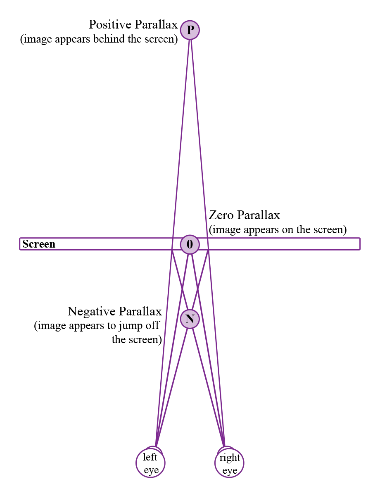
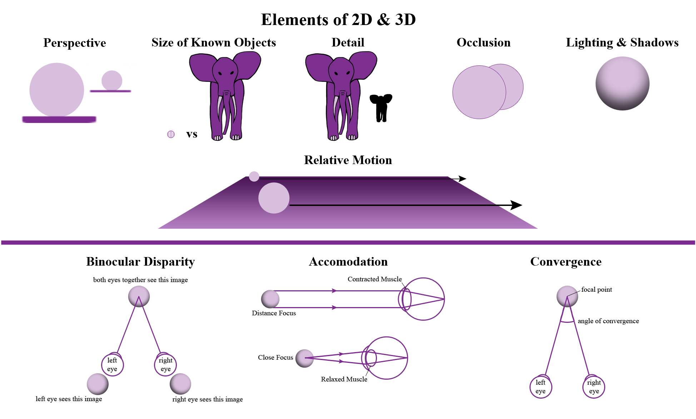

# How Virtual Reality is Shaping the Design of Games & Art, and Influencing the Future

Since the early 1990s, virtual reality has been on the horizon of gaming, but only recently have we seen a significant progression in the design of virtual reality (VR) systems. In 2015, at the Game Developer’s Conference in San Francisco, four different VR headsets were showcased – Oculus Rift’s Crescent Bay, Samsung’s Gear VR, HTC’s Vive, and Sony’s Morpheus. While each one has advantages and limitations, the question remains as to how to design games and art to take full advantage of these systems.

Artists and scientists conceived and developed virtual reality; however, technology had to advance in order for this vision to become a consumable reality. It is believed that the first attempt at VR was in the 1860s, when artists started creating three-dimensional panoramic murals. Yet, it was not until the late 1950s that a young electrical engineer and former naval radar technician, Douglas Engelbart, had the idea to use computers as tools for digital display. After World War II, the U.S. military invested millions of dollars into technology to simulate airplanes and other military vehicles. The military wasn't the only entity interested in computer graphics.

In 1957, the filmmaker Morton Heilig created the first VR system, the Sensorama, an arcade-style box with a 3D display, vibrating seat, and scent producer. He imagined that this device would become the "cinema of the future," but that future did not materialize within his lifetime.

In 1965, Ivan Sutherland conceived of The Ultimate Display, "a room within which the computer can control the existence of matter." Three years later, Sutherland developed the first version of a VR headset when he built a periscope-like video apparatus called the "Sword of Damascus," which connected to a computer to display a virtual world to viewers. 

In the late 1960s, video artist and programmer Myron Krueger coined the term "artificial reality" as he created a new type of interaction between man and machine. By the 1970s, Hollywood blockbuster movies, such as Star Wars, were using computer-generated special effects. In 1982, Tron became the first Hollywood movie to depict virtual reality. In 1987, Jaron Lanier, the founder of VPL Research coined the term "virtual reality." This was one of the first companies to implement applications for virtual reality experiences. These advancements and many others helped pave the way for the present day's high-performance virtual reality experience. With this said, virtual reality is a meticulously constructed experience, not simply a screen to throw into a viewer's face via a headset.

## How Does VR Work?

In order for the stereoscopic process of VR headsets to work (the process in which the eyes are tricked into seeing a three-dimensional image), each eye is paired with a slightly different stereo image. These images cannot be separated more than a person's average interpupillary distance (IPD), the distance between the centers of the pupils (which ranges from 54 mm to 70 mm). This degree of separation determines the degree of stereoscopy, or whether the object appears close or far away from the viewer. In order for the image to appear to pop off the screen, the left and right images are switched for each eye, creating negative parallax. Positive parallax is created when an image appears to be behind or buried deep within the screen. When there appears to be no three-dimensional image, the focal point is at the same depth as the screen, or at zero parallax.

---

*Various types of parallax used to make Virtual Reality possible.* 
Used with Permission: Jenn Swanson

---

Humans have binocular vision, meaning that each eye perceives an object from a slightly different angle. The brain combines these two images and fuses them to create a single image. This process creates depth. 

Though 2D images do not have depth, the brain can pick up on depth cues. These include:
1. Perspective
2. Size of known objects (certain objects are expected to be smaller than others - a tennis ball is smaller than an elephant)
3. Detail (close objects appear in more detail)
4. Occlusion (if an object is in front of another)
5. Lighting and shadows
6. Relative motion (objects in the distance seem to be moving slower than objects close by)

In 3D images, the brain picks up additional cues:
1. Binocular disparity (the difference in images due to IPD)
2. Accommodation (the muscle tension needed to change the focal length of the eyes to a particular depth)
3. Convergence (the muscle tension needed to rotate each eye to the focal point)

When creating a stereoscopic image, one uses these cues together. Traditionally, 3D images are created by switching between the left and right images, or superimposing the left and right together using filters. For VR headsets, parallel images are provided for each eye, leaving the brain to fuse the two images together, much like how one perceives depth in real space.

---

*The Elements of 2D and 3D.* 
Used with Permission: Jenn Swanson

---

In addition to the distance between images, the edges of the screen itself should be kept outside the user's field of view (FOV) for a better VR experience. A person's normal field of vision is about 150° to 180° when using both eyes. However, one cannot see everything in focus at once. An FOV of a little less than 100° is needed for immersion, thus many VR headsets currently have at least a 90° field of view (for instance, Oculus Rift has a 110° field of view). By hiding the edges, the viewer is further immersed into the virtual world.