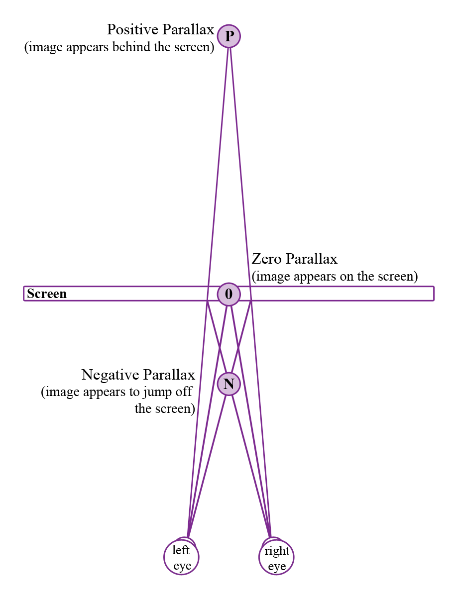
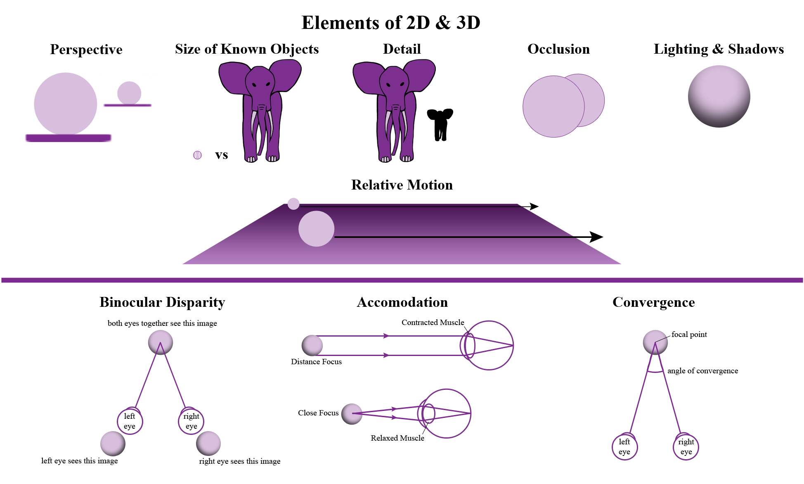
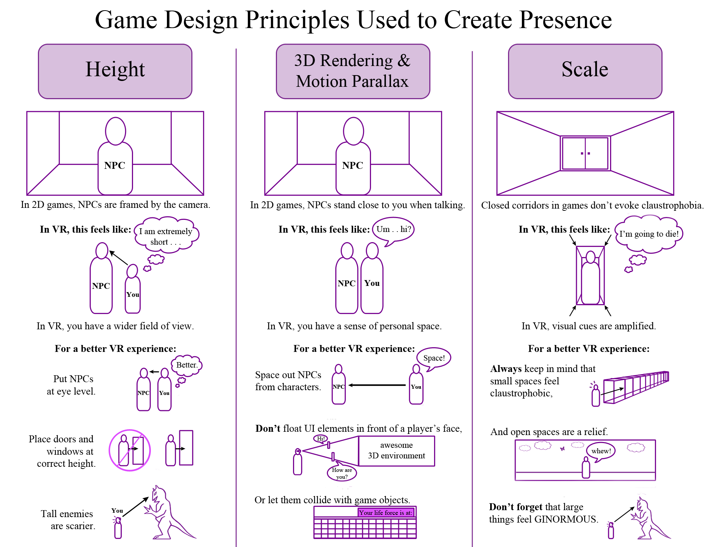

# How Virtual Reality is Shaping the Design of Games & Art, and Influencing the Future

Since the early 1990s, virtual reality has been on the horizon of gaming, but only recently have we seen a significant progression in the design of virtual reality \(VR\) systems. In 2015, at the Game Developer’s Conference in San Francisco, four different VR headsets were showcased – Oculus Rift’s Crescent Bay, Samsung’s Gear VR, HTC’s Vive, and Sony’s Morpheus. While each one has advantages and limitations, the question remains as to how to design games and art to take full advantage of these systems.

Artists and scientists conceived and developed virtual reality; however, technology had to advance in order for this vision to become a consumable reality. It is believed that the first attempt at VR was in the 1860s, when artists started creating three-dimensional panoramic murals. Yet, it was not until the late 1950s that a young electrical engineer and former naval radar technician, Douglas Engelbart, had the idea to use computers as tools for digital display. After World War II, the U.S. military invested millions of dollars into technology to simulate airplanes and other military vehicles. The military wasn't the only entity interested in computer graphics.

In 1957, the filmmaker Morton Heilig created the first VR system, the Sensorama, an arcade-style box with a 3D display, vibrating seat, and scent producer. He imagined that this device would become the "cinema of the future," but that future did not materialize within his lifetime.

In 1965, Ivan Sutherland conceived of The Ultimate Display, "a room within which the computer can control the existence of matter." Three years later, Sutherland developed the first version of a VR headset when he built a periscope-like video apparatus called the "Sword of Damascus," which connected to a computer to display a virtual world to viewers.

In the late 1960s, video artist and programmer Myron Krueger coined the term "artificial reality" as he created a new type of interaction between man and machine. By the 1970s, Hollywood blockbuster movies, such as Star Wars, were using computer-generated special effects. In 1982, Tron became the first Hollywood movie to depict virtual reality. In 1987, Jaron Lanier, the founder of VPL Research coined the term "virtual reality." This was one of the first companies to implement applications for virtual reality experiences. These advancements and many others helped pave the way for the present day's high-performance virtual reality experience. With this said, virtual reality is a meticulously constructed experience, not simply a screen to throw into a viewer's face via a headset.

## How Does VR Work?

In order for the stereoscopic process of VR headsets to work \(the process in which the eyes are tricked into seeing a three-dimensional image\), each eye is paired with a slightly different stereo image. These images cannot be separated more than a person's average interpupillary distance \(IPD\), the distance between the centers of the pupils \(which ranges from 54 mm to 70 mm\). This degree of separation determines the degree of stereoscopy, or whether the object appears close or far away from the viewer. In order for the image to appear to pop off the screen, the left and right images are switched for each eye, creating negative parallax. Positive parallax is created when an image appears to be behind or buried deep within the screen. When there appears to be no three-dimensional image, the focal point is at the same depth as the screen, or at zero parallax.

_Various types of parallax used to make Virtual Reality possible._  
 Used with Permission: Jenn Swanson

Humans have binocular vision, meaning that each eye perceives an object from a slightly different angle. The brain combines these two images and fuses them to create a single image. This process creates depth.

Though 2D images do not have depth, the brain can pick up on depth cues. These include: 1. Perspective 2. Size of known objects \(certain objects are expected to be smaller than others - a tennis ball is smaller than an elephant\) 3. Detail \(close objects appear in more detail\) 4. Occlusion \(if an object is in front of another\) 5. Lighting and shadows 6. Relative motion \(objects in the distance seem to be moving slower than objects close by\)

In 3D images, the brain picks up additional cues: 1. Binocular disparity \(the difference in images due to IPD\) 2. Accommodation \(the muscle tension needed to change the focal length of the eyes to a particular depth\) 3. Convergence \(the muscle tension needed to rotate each eye to the focal point\)

When creating a stereoscopic image, one uses these cues together. Traditionally, 3D images are created by switching between the left and right images, or superimposing the left and right together using filters. For VR headsets, parallel images are provided for each eye, leaving the brain to fuse the two images together, much like how one perceives depth in real space.

_The Elements of 2D and 3D._  
 Used with Permission: Jenn Swanson

In addition to the distance between images, the edges of the screen itself should be kept outside the user's field of view \(FOV\) for a better VR experience. A person's normal field of vision is about 150° to 180° when using both eyes. However, one cannot see everything in focus at once. An FOV of a little less than 100° is needed for immersion, thus many VR headsets currently have at least a 90° field of view \(for instance, Oculus Rift has a 110° field of view\). By hiding the edges, the viewer is further immersed into the virtual world.

## Building a VR World

Beyond the technical aspects of VR, there is also a need to give the player a sense of presence in VR games and environments to establish proper realism. Scientist Mel Slater divides presence into two parts, cognitive \(mind\) and perspective \(senses\). Cognitive presence, where the mind is taken to another world, can easily be obtained while watching a movie or reading a book. However, perspective presence, when the senses are tricked into believing that they inhabit a virtual environment, is harder to evoke. For this reason, games that are simply adapted to VR fail to immerse the player. Instead, there is a need for games to be designed to the VR medium.

There are three major game design principles that can be used to create this sense of presence, starting with height. In a non-VR game, non-playable characters \(also known as NPCs\) are usually displayed as taller than the playable character, so to better frame them. The world is scaled down so that NPCs can be fit into the field of vision of the screen. However, in VR, this makes things confusing; the player feels that the playable character is unnaturally short. Putting NPCs at eye level and having doors and windows sized properly and placed at the correct height to the character in the game adds to the player’s belief in this world. Also, creating enemies that tower over the character will evoke a greater scare factor than short ones.

The second principle that can be implemented in VR is 3D rendering and motion parallax, which create a sense of space not present in non-VR games. These elements also invoke an awareness of personal space within the game. In non-VR games, NPCs stand very close to a character when talking. Though this helps to see the detail of that character, in VR, this creates an invasion of personal space. The NPC seems to be standing directly on top of the playable character. Also, it becomes important that user interface \(UI\) elements, such as the status bar, do not float in front of the player's face and smother personal space. Though these UI elements could recede into space, they may collide with other objects in the game and become distracting. The best method seems to be integrating the status bar into an existing object necessary to carry throughout the game. Creating this type of gameplay can lead to a better experience as a whole.

This leads into the third principle of game design in VR, which is scale. Since everything from the player's point of view is in full stereo, visual cues are amplified. Large objects feel truly massive, and giant enemies are terrifyingly ginormous. Designers need to be careful when creating closed corridors, as small spaces can cause claustrophobia. Alternatively, when a player transitions from a narrow hallway to a wide open space, they are immediately imparted with a sense of relief. Spotting the differences in the experience of playing a VR game versus a non-VR game can further inform the choices in what to design into the game and how to shape the environment.

_Game design principles used to create presence._  
 Used with permission: Jenn Swanson

The goal of virtual reality games is to create and maintain presence; breaks in presence cause a player to quickly become ejected from the experience. In order to avoid these recesses, content design should have a fixed sense of locomotion, usually using lateral movement \(keeping the player fixed to the ground plane they are standing on\), since fast changes in altitude can cause motion sickness. Points of reference also help to gauge where the player is in the game, and keep the playability on target. Though each individual has a different comfort level with VR, users can acclimate to the virtual world over time if its rules are easily understood and consistent. Good game design in VR avoids any unexpected perspective changes. Shifts in the horizon line can cause disorientation. Cut scenes, while important for narrative and visually stunning in non-VR games, are unnecessary in a VR experience. Furthermore, disabling head look \(the action that lets a player look around the virtual environment using the VR headset\) or moving the camera artificially breaks immersion in the virtual world.

The player should be in control of the camera as much as possible. Camera knockback and camera shake are artificial elements that cause a break in the experience. Visual head rotation should always match actual head rotation. Nonetheless, stationary experiences typically work well for everyone. As long as a sense of presence is maintained, the player will likely adjust to and enjoy the VR experience.

## Adding Your Hands

While head tracking is essential to any full VR experience, hand tracking has also been making its way into the virtual reality world. Sony's Morpheus has two controllers, \(aptly called The Eye and The Move\) which manipulate the gamer's view and position, and let the player see their hands in virtual space. HTC's Vive also has a hand-tracking component using two joystick-like controllers with a touchpad click surface. On the other hand, Oculus' Crescent Bay and Samsung's Gear VR do not have this experience tied into their packages; however, third party hardware developer, Leap Motion has been making a controller that can tie into any VR headset. Similar to the Xbox's Kinect, it tracks hands and can even operate without any VR input.



The addition of hand tracking within gameplay will open up a whole new immersive experience in VR games. These controllers will be able to act as physical touch points within a game. Morpheus controllers take this experience to the next level, by tracking the controllers once they are set down so that they are still visible to the player in virtual reality. Morpheus is adding another component for the ability to put down one VR item and pick up another using the same controller. This will help to create and maintain a sense of presence in gameplay.



## Being Someone Else

The advancement in VR is not only changing the way games are played, it is also [changing art](https://www.theguardian.com/technology/2014/nov/20/virtual-reality-art-future-games) as a whole. Games fall into a subcategory of art, which is broadly defined as the "expression or application of human creative skill and imagination." Though games are categorized as art, many tend to fulfill an escapist fantasy, rather than fully immerse us in another world as a relatable character. This may change with the evolution of VR; however, games, especially action games, tend to focus on the events happening in their virtual world and fall into creating archetypal characters. No one can really relate to Master Chief \(a video game protagonist\), though it is fun to play him in Halo on the Xbox. Good art is an experience that evokes an emotion from the viewer; this is very similar to that sense of presence mentioned earlier – and it's what the developers at Oculus Rift are trying to create.

One of the most well-known VR art pieces emerged in 1995 when Cher Davies created [Osmose](http://www.immersence.com/osmose/), an:

> "immersive interactive virtual-reality environment installation with computer graphics and interactive 3D sound, a head-mounted display, and \[a\] real-motion tracking \[vest\] based on breathing and balance."

Through the use of their own breath and balance, participants were able to journey between a dozen world-spaces, based mostly on metaphorical aspects of nature, as well as other worlds filled with code from the project and quotes from the artist. Though this is not an example of where the current market is, it is where it started in the 90s. This is what happens when art and science come together: technology advances.

Currently, artist Mark Farid is undertaking a radical project called [Seeing I](http://www.seeing-i.co.uk/), in which he plans to wear an Oculus Rift headset and live another person's life for 28 days. The project is both one of psychological and artistic curiosity. Whether this experience will change how he perceives his reality after those 28 days is the key question, and it is uncertain whether any potential damage to Farid's mental health could be repaired. Another art installation, called [The Machine to be Another](https://vimeo.com/84150219), focuses on the concept of body transfer illusion, the idea that the brain can be tricked into taking ownership of a body or body part that is not one's own. In this art piece, participants of different genders swap bodies via the Oculus. Similar projects have been found to teach people about empathy and decrease racial bias, by literally putting someone in someone else's shoes.

## Augmented Reality

Finally, while virtual reality headsets are planning to immerse us in worlds different from our everyday lives, augmented reality headsets are being constructed to put virtual data into our daily lives. These include the infamous Google Glass, as well as Microsoft's Project HoloLens, an AR headset that Microsoft claims will be wire-free with all the hardware integrated into the device itself. Though the prototype hasn't come that far yet, the HoloLens is able to scan an environment and insert digital projections into the real world. However, the image is confined to a viewer's center of vision, equal to about forty percent of the field of view.

There is another AR device secretly being developed. A small company called Magic Leap is creating what they term "cinematic reality." While they are also constructing an AR headset, they are developing a new way to generate virtual objects in real space, using something called digital light-field signal technology. The current description is:

> "a lightweight head-mounted device that will house a tiny projector comprised of bespoke prisms and lenses that will beam images onto the user's retinas creating a 'dynamic digitized light field signal.' Apps, powered by mobile devices or body worn computers, will generate a steady stream of fantastic creatures and surreal tableau delivered with stereo speakers and at sixty frames per second."

These images will be integrated into the real world using infrared positioning cameras, GPS modules, and multi-axis accelerometers. Thus far, Magic Leap has not released a prototype, but it is [rumored](https://www.youtube.com/watch?v=XAzsblOH83s) that ‘golden tickets’ are coming

## A Future with VR/AR

With all that is going into the making of virtual experiences, the future is open to many possibilities. Within the next twenty years, we may be surfing the Internet with our AR headsets, gaming in virtual worlds that feel more real than reality, and experiencing the world daily as other people through virtual body transfer illusion.

Prejudice may be completely eradicated due to this technology. Vacations may become weekly virtual experiences where people never have to leave their homes. Virtual reality may become the source of entertainment for the next generation. And people may lose their identities as they delve deeper into virtual space.

Who knows what will happen as these technologies advance?

### About the Author

Jenn Swanson is a 2D and 3D artist.

### References

* Ashford, J. \(2014\). [**Rebooting Game Design for Virtual Reality.**](http://www.gdcvault.com/play/1020914/Rebooting-Game-Design-for-Virtual) GDC Vault.
* Bourke, P. \(1999\). [**Calculating Stereo Pairs.**](http://paulbourke.net/stereographics/stereorender/)
* Flaherty, J. \(2015\). [**Revealed at Last: Magic Leap’s Vision for Augmented Reality, in 32 Patent Illustrations.**](http://www.wired.com/2015/01/magic-leaps-vision-for-virtual-reality/) Wired.com.
* Kuntz, S. \(2013\). [**Creating Virtual Reality Games: The Fundamentals.**](http://www.gamasutra.com/view/feature/192810/creating_virtual_reality_games_.php?page=2) Gamasutra.
* Hempel, J. \(2015\). [**Satya Nadella’s Got a Plan to Make You Care About Microsoft. The First Step? Holograms.**](http://www.wired.com/2015/01/microsoft-nadella/) Wired.com.
* Lapowsky, I. \(2015\). [**Magic Leap CEO Teases ‘Golden Tickets’ for Its Augmented-Reality Device.**](http://www.wired.com/2015/02/magic-leap-reddit/) Wired.com.
* Luckey, P. and N. Mitchell. \(2013\). [**Virtual Reality Gaming and Game Development.**](http://www.gdcvault.com/play/1019290/Virtual-Reality-Gaming-and-Game) GDC Vault.
* Nelson, F. \(2014\). [**The Timeline Of Virtual Reality - The Past, Present, And Future Of VR And AR: The Pioneers Speak.**](http://www.tomshardware.com/reviews/ar-vr-technologydiscussion,3811-2.html) Tom’s Hardware.
* Ochalla, B. \(2007\). [**Art on the Brain.**](http://www.gamasutra.com/view/feature/130113/are_games_art_here_we_go_.php) Gamasutra.
* [**Osmose.**](http://www.immersence.com/osmose/) \(1995\). Immersence Inc.
* Prasuethsut, L. \(2015\). [**Project Morpheus Review.**](http://www.techradar.com/us/reviews/gaming/project-morpheus-1235379/review) TechRadar.
* Robertson, A. and M. Zelenko. [**The Rise and Fall and Rise of Virtual Reality.**](http://www.theverge.com/a/virtual-reality/oral_history) The Verge.
* Rubin, P. \(2014\). [**The Inside Story of Oculus Rift and How Virtual Reality Became Reality.**](http://www.wired.com/2014/05/oculus-rift-4/) Wired.com.
* Stein, S. \(2015\). [**HTC Vive Developer Edition Preview.**](http://www.cnet.com/products/htc-vive-developer-edition/) CNET.
* Stuart, K. \(2014\). [**The Identity Paradox: Why Game Characters Are Not Us, but Should Be.**](http://www.theguardian.com/technology/2014/apr/24/the-identity-paradox-why-game-charactersare-not-but-should-be) The Guardian.
* Stuart, K. \(2014\). [**What a Virtual Reality Art Show Could Say about the Future of Games.**](http://www.theguardian.com/technology/2014/nov/20/virtual-reality-art-future-games) The Guardian.
* [**Virtual Reality: History.**](http://archive.ncsa.illinois.edu/Cyberia/VETopLevels/VR.History.html) \(1995\). Science for the Millennium. The Board of Trustees at the University of Illinois.

