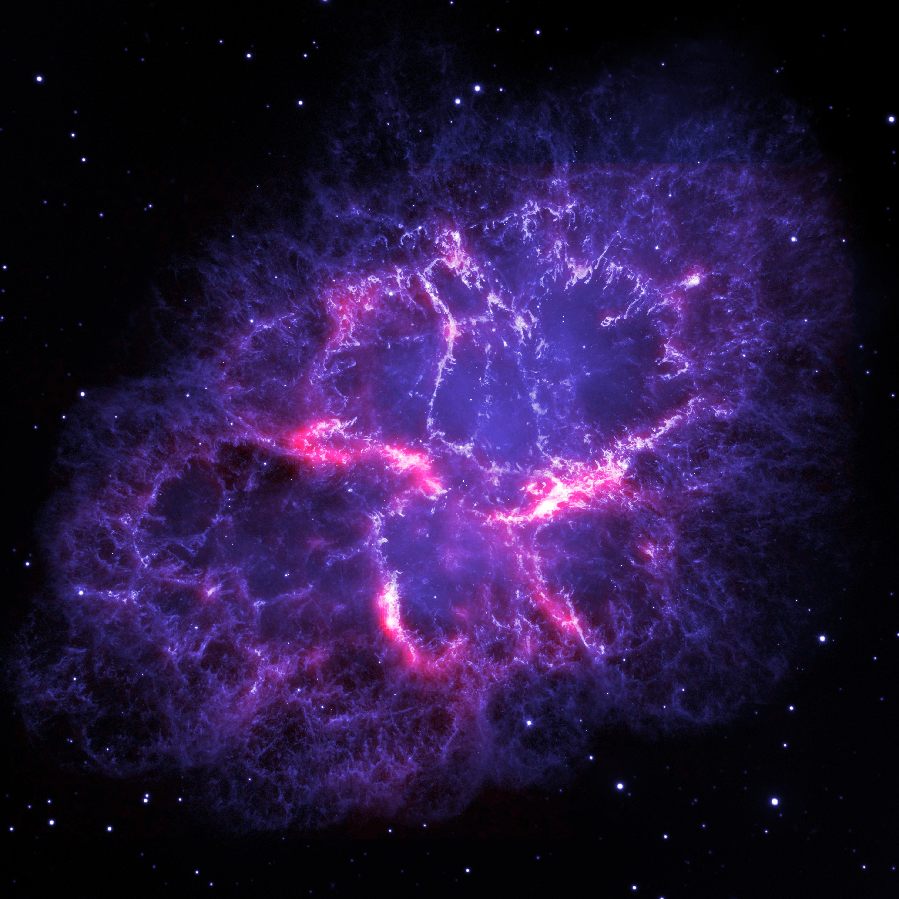

# A Gamer's Insight into Reality

#### Alex Vosburgh

Image Credit: ESA/Herschel/PACS /MESS Key Programme Supernova Remnant Team; NASA, ESA and Allison Loll/Jeff Hester (Arizona State University)

---

It is human nature to ponder the state of one's own existence. And indeed, one cannot ponder
the nature of their existence without also considering the nature of the world around them. For what is existence without the collective memories and experiences one has acquired throughout their lifetime? It is through those events and the analysis of such happenstances
that one can truly begin to discover themselves; to understand their place in the world and what that even means. Verily, I find that to be one of the nobler parts of humanity and its higher state of consciousness.

And yet, one cannot delve into such introspections before coming face to face with ambiguous,
difficult, and unanswerable questions. Challenges such as the origin of existence, purpose, the rules of the universe, and what may lie within or beyond have stared at humanity for as long as humanity has been able to stare at the world in the first place.

Unfortunately, the universe is a vastly complex thing, and is often difficult to even begin
to wrap your mind around. Although humanity is continuously trying to solve its mysteries, there is still a lot left unanswered making it difficult to truly understand and contemplate. Fortunately, humanity is also creative, and through that creativity we have managed to create a great many worlds of our own. Whether through books, movies, or video games, these created universes give us a vehicle that we can use to isolate and tackle some of the difficult questions which plague our minds.

Many projects are using these mediums to do just that, taking on difficult subjects such as
social issues, morality, and even the way we look at the world around us. And many have
done this to great success, gathering a great deal of followers and supporters. For some
people, these followings border on obsession, and in some cases in can be difficult to decipher where the fantasy ends and reality begins. But what if our own universe is just such a creation?

Using insane amounts of processing power on supercomputers that perform a staggering amount of calculations per second, researchers have been able to run simulations of our own universe. Using all of the knowledge that we have been able to discover about the rules of our universe so far, these simulations have managed to achieve results strikingly similar to the universe we observe around us.

If we are perfectly able to recreate our universe in a simulation, then it stands to reason
that in that simulation, there would be a simulated Earth, and on that simulated Earth, simulated humans must exist as well. And if we were to run that simulation long enough,
those simulated humans would reach a point where they would have supercomputers powerful enough to run a simulation of their universe. A simulation exactly like the one we are running. Which means that there would exist a simulation within our simulation, and that iteration would inevitably reach the same point that it could run its own simulation.

The implication of this thought is that there is potentially an infinite string of universes
exactly like our own that are merely simulations of the universe. There would be only one original universe; the rest would be one of the simulations. Of course, this begs the
difficult question: are we the original universe? Statistically speaking, it would be impossible for ours to be the original. But if that were the case, then we should be able to find some evidence of the fact that this is a simulation. The big question there is where should we look to find that evidence. The answer actually comes from looking at video games.

Video games themselves are nothing more than simulations, they simply use different rules than the simulation designed to recreate our universe. But all games do have certain limitations, even if we are able to create more and more advanced versions of them. These limitations are where the evidence lies that they are a simulation and not technically a part of reality. Therefore, a look at what some of these limitations are should provide a good example of limitations of our own simulation, if that is indeed what our universe consists of.

First off, all games have rules. These rules are what defines the interactions of everything in
the game, and our universe very clearly has rules. The theories of gravity and electromagnetism, solid, liquid, and gas states and how they behave, and even light are all very clear examples of this. Indeed, it is by discovering those rules and what they mean that humanity has come to understand the universe so well.

All video games also have a very clear resolution. While current games look more realistic than ever, if you were to zoom in enough on any game, there would come a point where that resolution would break down and you would see the individual particles that make up everything that you see. In games, these are often called pixels. In our universe, these can better be thought of as sub-atomic particles.

Everything that exists in our universe is composed of atoms, tiny particles that, depending on their structure and size, define the properties of every single element in our universe. But even atoms are comprised of several different components with exotic names such as quarks and gluons, among others. These are our pixels. These are the tiniest pieces of the universe, and they come together to form atoms, which come together to form elements, which come together to form molecules, which come together to form more and more complex components, and it is these
components that make up everything in the universe. Which means that our universe has a very clearly defined resolution.

Interestingly enough, these tiny components also make up the coding for our universe. All games are coded in a programming language that make up the rules and logic that defines how the game runs. These particles do the exact same thing for our universe. The different ways they move and interact dictate the properties of everything that exists. The language of these subatomic particles is complex and strange, but there is reason to it. As modern scientists study it further, we come closer to unlocking all of the secrets of the universe.

Who knows if we'll ever fully understand our home, the universe we live in. It is vast and complex and sometimes doesn't seem to make a whole lot of sense. But that won't stop us from trying to figure it out. As long as humanity has its curiosity, we shall always question
things, and inevitably seek the answers to those questions. Which means it's only a matter of time until we are able to discern whether we live in a majorly complex version of The Sims or not. 